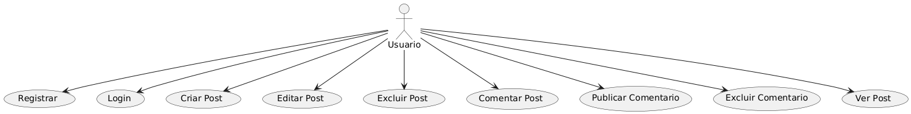

# Projeto: DM Blog Pessoal

## Descrição do Projeto
Um blog onde os usuários podem criar, editar e excluir posts, com suporte a comentários, tags e categorias. Também incluirá funcionalidades de busca por posts e perfis de autores.

### Funcionalidades:
- **Editor de texto enriquecido:** Permitir que os usuários criem conteúdo formatado.
- **Sistema de comentários:** Os usuários poderão comentar em posts.
- **Categorias e tags:** Classificação dos posts para facilitar a navegação.
- **Busca por posts:** Um mecanismo de busca para encontrar posts específicos.
- **Perfil de autor:** Exibir informações sobre o autor de cada post.

## Objetivos SMART

1. **Específico:** Criar um blog pessoal com sistema de postagens, comentários e categorização.
2. **Mensurável:** Implementar o sistema com uma base de dados que permita armazenar ao menos 100 posts e processar 1.000 visitas diárias até o final do projeto.
3. **Atingível:** A plataforma será desenvolvida usando tecnologias web modernas (React, Node, MongoDB).
4. **Relevante:** O blog permitirá que autores gerenciem conteúdo e interajam com leitores, aumentando o engajamento e a relevância no ambiente digital.
5. **Temporal:** O projeto será concluído em 3 meses, com um MVP lançado em 2 meses.

## Cronograma (Diagrama de Gantt)

| Tarefa                             | Início         | Fim            | Duração (dias) |
|------------------------------------|----------------|----------------|----------------|
| Definição do escopo                | 10/09/2024     | 12/09/2024     | 3              |
| Estruturação do Banco de Dados     | 13/09/2024     | 18/09/2024     | 5              |
| Design e Wireframes                | 19/09/2024     | 24/09/2024     | 5              |
| Implementação do Front-End (React) | 25/09/2024     | 10/10/2024     | 15             |
| Implementação do Back-End (Node)   | 11/10/2024     | 30/10/2024     | 20             |
| Integração com o Banco (MongoDB)   | 01/11/2024     | 10/11/2024     | 10             |
| Testes e correções                 | 11/11/2024     | 20/11/2024     | 10             |
| Lançamento MVP                     | 25/11/2024     | 25/11/2024     | 1              |

## Análise de Risco

1. **Riscos Técnicos:**
   - Falta de integração correta entre front-end e back-end.
   - Problemas de performance no sistema de busca.

2. **Riscos de Prazo:**
   - Atraso na implementação de funcionalidades críticas como o editor de texto enriquecido.
   - Dependência de terceiros para bibliotecas externas.

## Recursos

1. **Equipe:**
   - 1 Desenvolvedor Front-End.
   - 1 Desenvolvedor Back-End.
   - 1 Designer.
   - 1 Gerente de Projeto.

2. **Tecnologias:**
   - **Front-End:** React
   - **Back-End:** Node.js
   - **Banco de Dados:** MongoDB
   - **Hospedagem:** AWS ou DigitalOcean

## Diagrama de Classes

## Diagrama de Casos de Uso

## Diagrama de Fluxo

 
