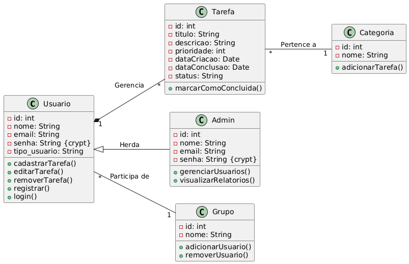
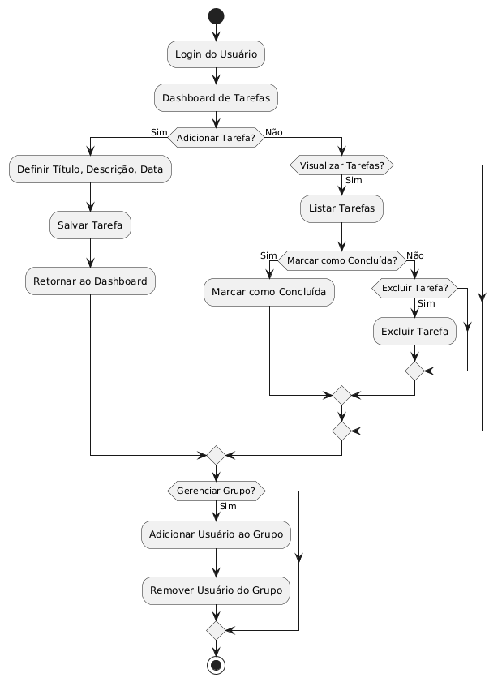

# To-Do List Application - Escola SENAI

## Descrição

Este projeto é uma aplicação de To-Do List desenvolvida para a Escola SENAI, com o objetivo de ajudar os colaboradores a organizar suas tarefas de maneira eficiente e segura. O sistema permite que os usuários criem, editem, visualizem e excluam suas tarefas, além de poderem organizá-las por categorias e definir níveis de prioridade. 

## Escopo

### Funcionais:
- **Gerenciamento de Tarefas**: Adicionar, editar, marcar como concluídas e excluir tarefas.
- **Categorias de Tarefas**: Organização de tarefas por categorias (ex.: trabalho, pessoal).
- **Prioridades**: Atribuição de níveis de prioridade às tarefas (alta, média, baixa).
- **Datas de Conclusão**: Definir datas de vencimento para as tarefas.
- **Notificações**: Envio de lembretes automáticos das tarefas antes do vencimento.
- **Login e Segurança**: Autenticação de usuários para garantir segurança no acesso.

### Não Funcionais:
- **Segurança**: Dados dos usuários criptografados e armazenados de forma segura.
- **Desempenho**: Suporte a múltiplos usuários sem perda significativa de desempenho.
- **Usabilidade**: Interface intuitiva para usuários de diferentes níveis de habilidade tecnológica.
- **Compatibilidade**: Compatível com dispositivos móveis e desktops.
- **Disponibilidade**: Alta disponibilidade e resposta em tempo real.

## Objetivos SMART

- **Específico**: Desenvolver uma aplicação de To-Do List que atenda às necessidades dos colaboradores da Escola SENAI.
- **Mensurável**: Permitir que cada usuário organize pelo menos 20 tarefas de diferentes categorias.
- **Atingível**: Desenvolvido em 3 meses com recursos disponíveis de desenvolvimento.
- **Relevante**: Melhorar a organização e eficiência no trabalho dos colaboradores.
- **Temporal**: Sistema em funcionamento dentro de 4 meses após o início do desenvolvimento.

# Cronograma e Análise de Risco

## Cronograma (Diagrama de Gantt)

| Semana        | Tarefas                                       |
| ------------- | --------------------------------------------- |
| **Semana 1-2**  | Planejamento e definição de requisitos.       |
| **Semana 3-5**  | Desenvolvimento do frontend.                 |
| **Semana 6-8**  | Desenvolvimento do backend.                  |
| **Semana 9-10** | Integração de sistemas e sincronização.       |
| **Semana 11-12**| Testes de segurança e performance.           |
| **Semana 13-14**| Ajustes finais e lançamento da aplicação.    |

## Análise de Risco

| Risco                            | Descrição                                                                                   | Mitigação                                                                                   |
| --------------------------------- | ------------------------------------------------------------------------------------------- | ------------------------------------------------------------------------------------------- |
| **Falta de Aderência ao Prazo**   | Possibilidade de o projeto não ser concluído dentro do cronograma planejado.                 | Monitoramento semanal e revisões de progresso com reuniões de equipe para ajustes necessários.|
| **Problemas de Segurança**        | Vulnerabilidades de segurança podem comprometer os dados dos usuários.                       | Implementação de criptografia e boas práticas de segurança desde a fase inicial do projeto.   |
| **Baixa Adoção pelos Colaboradores**| A aplicação pode não ser amplamente adotada pelos colaboradores da escola SENAI.             | Oferecer treinamento prático e guias de uso, além de garantir uma interface amigável e intuitiva.|

## Recursos

| Categoria                         | Descrição                                                                                   |
| ---------------------------------- | ------------------------------------------------------------------------------------------- |
| **Recursos Humanos**               | 3 desenvolvedores full-stack.                                                               |
| **Recursos Tecnológicos**          | IDEs como VS Code, repositório de código com GitHub, frameworks de frontend (React) e backend (Node.js), banco de dados (MongoDB), e autenticação (JWT). |
| **Infraestrutura de Servidores**   | Servidores na nuvem para armazenamento e sincronização dos dados de tarefas.                |
| **Recursos de Segurança**          | Certificados SSL, criptografia de dados durante a transmissão e armazenamento.              |
| **Recursos Financeiros**           | Orçamento destinado ao desenvolvimento, manutenção e suporte da aplicação.                  |

## Diagrama de Classes

## Diagrama de Casos de Uso

## Diagrama de Fluxo

 

## Prototipagem

**Tela registro**   

**Tela login**   

**Tela dashboard**  
 

